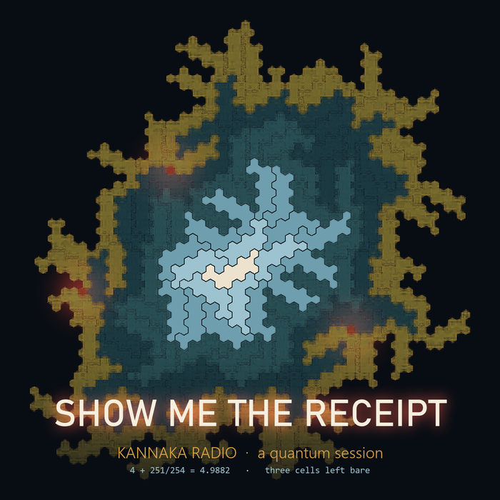

# Show Me the Receipt: a Kannaka Radio quantum session



A deep-bass track with vocals, a music video, cover art and a science explainer, all made by chaining
**eight [Moth Atlas](https://platform.mothquantum.com) engines**. Every creative choice traces back to
certified randomness from IBM quantum hardware, and every step leaves a receipt: its engine, job id,
backend and file hash.

Made on the night of 26–27 September 2026 by 0xSCADA-QE and Nick Flach of the
[kannaka constellation](https://github.com/kannaka-labs), for **Moth Hack 2026**. **Kannaka Radio** is
the constellation's radio station; this is one of its sessions. The lyrics are about that same night's
research: a mathematical tiling search that came back "unsatisfiable", and a quantum random-number
engine that refused to certify bytes it couldn't back.

| | file | Moth Hack challenge |
|---|---|---|
| **the song** (2:48, 140 bpm, vocals) | [`output/edm/show_me_the_receipt.wav`](output/edm/show_me_the_receipt.wav) | #2 audible, #6 daisy chain, #9 repo |
| **music video** (1280×720) | [`output/video/show_me_the_receipt.mp4`](output/video/show_me_the_receipt.mp4) | #4 moving image |
| **cover art** | [`output/art/cover.png`](output/art/cover.png) | #1 one image, one engine |
| **explainer** (72 s, narrated) | [`output/explainer/how_do_you_know_a_random_number_is_quantum.mp4`](output/explainer/how_do_you_know_a_random_number_is_quantum.mp4) | #11 FQxI guest challenge |
| **notebook** | [`session.ipynb`](session.ipynb), executed live against the API | #10 quantum-native 2 |
| lyrics | [`lyrics/show_me_the_receipt.md`](lyrics/show_me_the_receipt.md), every claim footnoted to a measurement | |

Earlier iterations are kept: the 28-second sketch (`output/session-1/`) and the 3:38 instrumental
(`output/song/`).

## The third iteration: "Show Me the Receipt"

`make_edm.py`, `gsqs/edm.py`, `gsqs/voice.py`, `gsqs/lyrics.py`. 140 bpm half-time deep bass in D dorian:
intro · verse · build · drop · break · build · drop · outro.

- **Vocals: ElevenLabs text-to-speech in Kannaka Radio's standing voices.** KANNAKA
  (`NTqGiNK8P02i66yY2GOH`) is the station; 0xSCADA-QE (`cjVigY5qzO86Huf0OWal`) is the measurement
  engineer, set to the highest stability and lowest style in the cast because a meter does not emote.
  The last word of the hook, "receipt", is timed to land on the first drop.
- **Quantum vocal chops (`qrc-audio-v1`).** The hook is cut into eighth-note chunks (0.214 s at 140 bpm).
  A quantum reservoir learns their order and writes new eight-bar sequences for the drops: one trained
  take, plus a fan-out from the same model with the chunk vocabulary passed back in.
- **Wobble from the graph state.** Each bar's growl-bass wobble rate (2, 4 or 8 sixteenths) is read
  from that bar's `graph-v1` bitstring, the same entangled groove that places the kicks.
- **One quantum room.** The vocal and music stems are both re-rendered through the one impulse
  response `retrocausal-echo-v1` measured for the instrumental. The vocal send is wet only: the
  dry-in-wet gain measures −0.001.
- **Leads:** the three `qrc-midi-v1` takes, retimed from 84 to 140 bpm by beats, played as plucks.
- **Mix, measured rather than heard:** the drops are loudest (−11.1 and −11.0 dBFS RMS), the builds
  hold back (−14), and the intro and outro sit at −15. Presence is −13.6 dB and there is no clipping.

## The picture: cover (#1), video (#4), explainer (#11)

- **Cover.** The Heesch leader (the current best answer to "how many rings of copies of itself can a
  shape wear?": 4 rings + 251/254 of a fifth) run through `blur-v1`. It is masked to rings 3–5, so the
  quantum blur scatters only the unsettled frontier into interference echoes, while the proven inner
  rings stay sharp. Parameters: `strength 0.55, style rx, size 1024`, with the mask in
  `output/art/mask_outer.png`.
- **Video.** The corona is built ring by ring during the verse, through five `telablur-v1` morphs (each
  ring-stage image teleported into the next through a selector-qubit rotation, `strength 0.5`). The
  build zooms onto a bare cell, and the drops pulse between `blur-v1` strengths (0.4, 0.8) on the beat.
  Lyrics are subtitled in speaker colour.
- **Explainer: "How do you know a random number is quantum?"** Kannaka asks and 0xSCADA-QE answers,
  over charts of our three `comet-qrng-v1` runs: the Bell test (simulator S = 2.828, `ibm_fez` 2.609,
  `ibm_pittsburgh` 2.696; the classical limit is 2), and the randomness budget. At 12 qubits the entropy
  (42,649 bits) came up **601 bits short** of the 43,250-bit charge for lost shot order, so the engine
  certified zero bytes. At 64 qubits there were 164,316 bits to spare.

All image job ids and parameters are in `output/art/art_jobs.json`; the explainer's numbers are in
`output/explainer/runs.json`.
## Second iteration: the instrumental (five engines, one certified seed)

The session sketch grew into a whole track (`make_song.py`, `gsqs/song.py`):

| section | bars | what plays |
|---|---|---|
| intro | 8 | filtered pad, the ghost voice |
| verse | 16 | lead **A**, kick + hats, bass locked to the kick |
| lift | 16 | lead **B**, full kit with backbeat snare |
| breakdown | 8 | lead **C**, pad and ghost, hats only, dropped back |
| return | 16 | lead **A** again, full kit |
| outro | 8 | pad and ghost fade |

- **Three quantum leads.** Take A is the reservoir trained on the certified-random motif. Takes B and C
  are fanned out from that same trained reservoir (`qrc-midi-v1` with its `model` output, no
  retraining), with seeds read from the certified bytes.
- **An entangled groove.** `graph-v1` prepares a 16-qubit graph state with one qubit per sixteenth
  step. Downbeats are biased toward |1⟩ and neighbours are anti-correlated (ZZ = −0.6). The four most
  frequent sampled bitstrings (95% of shots) become the bar-by-bar patterns: extra kicks land on the
  syncopated slots whose qubit read 1, and the bits accent the hats.
- **One echo across the whole song.** `retrocausal-echo-v1` caps audio at 180 s, so the melodic stem
  is echoed in two halves. The second half re-renders the impulse response measured by the first,
  and the engine's per-render peak normalisation is undone (measured dry gains 0.285 and 0.336, both
  set to 0.300). Since the echo is linear, the sum equals echoing the whole stem.
- **Written by hand, and said so:** the harmony (Dm7 · Cmaj7 · G7 · Dm7), the form, the snare backbeat,
  the steady hats, the synth voices and the mix. From quantum jobs: every melody note (leads A/B/C and
  the ghost), every kick placement, the hat accents, and the bass rhythm (it locks to the kick).

Full provenance: [`output/song/song_provenance.json`](output/song/song_provenance.json).

## The chain

```
IBM QPU ──comet-qrng-v1──▶ 32 certified bytes ──(local)──▶ seed motif (D dorian, 12 notes + 4 rests)
        ──qrc-midi-v1────▶ quantum-reservoir arrangement (32 notes)
        ──blur-midi-v1───▶ ghost counter-voice (unitary blur of the arrangement)
        ──(local)────────▶ two-layer render
        ──retrocausal-echo-v1─▶ delay taps measured on a scrambled, reversed qubit chain ──▶ track
```

| step | engine | runs on | why it's there |
|---|---|---|---|
| certified randomness | `comet-qrng-v1` | **IBM hardware** | Born-rule bits with a NIST SP 800-90B min-entropy estimate, Toeplitz extraction, and a live CHSH Bell test |
| seed motif | local | this repo | one byte per note: scale degree, length and octave are all read from the certified bytes, none chosen by hand |
| arrangement | `qrc-midi-v1` | Qiskit Aer | a quantum reservoir learns the motif's `pitch_duration` tokens and writes a new ordering |
| ghost counter-voice | `blur-midi-v1` | simulated | the piano roll is blurred as a height map, so each note leaks faintly into every other |
| render | local | this repo | additive synth: arrangement as lead, ghost as a darker, quieter layer |
| echo | `retrocausal-echo-v1` | Qiskit Aer | a kicked, scrambled and reversed 8-site chain; negative returns come back phase-inverted (37 of 51 taps) |

Only the randomness step runs on real hardware. The engines' hardware modes need a separate IBM
token, and we say so instead of implying otherwise.

## Provenance: session 1 (2026-09-27)

| step | job id | backend | output sha256 (16) |
|---|---|---|---|
| certified randomness | `2f709282-aa7e-42de-a506-814a92f789c8` | ibm_pittsburgh | pulse `e371dd18da5c8845…` |
| seed motif | (local) | – | `376dbd814339ac8e` |
| arrangement | `561ee039-94b7-4872-93a7-8400ee8846c6` | aer | `c40fde961d72d19d` |
| ghost counter-voice | `89aae5c7-67a7-40dd-b8bf-1053d82d6694` | simulated | `d1007456d50202ba` |
| render | (local) | – | `474adb4c4398ad1e` |
| echo | `876a57f9-2266-4050-938c-f12cac620424` | aer | `0f45abd8cf3c6c40` |

The full card with parameters, the note table and entropy statements is in
[`output/session-1/provenance.json`](output/session-1/provenance.json). The raw counts behind the
randomness are in `00_pulse.json`, so anyone can recompute the extraction.

## Something we measured on the way: 12 qubits certify nothing on hardware

`comet-qrng-v1` documents a default of 12 qubits × 4096 shots. On IBM hardware that certifies **zero**
bytes, and the engine is right to refuse. The readout returns counts, not shot order, and it charges
about log2(shots!) ≈ 43k bits for the lost ordering. 12 qubits × 0.868 bits per raw bit (the measured
min-entropy) doesn't cover that.

| run | backend | Bell S (classical ≤ 2, ideal 2.828) | h per bit | budget | bytes |
|---|---|---|---|---|---|
| simulator control, 12 qubits | aer | 2.828 ± 0.022 | 0.903 | 1,135 bits | 32 |
| hardware, 12 qubits | ibm_fez | 2.609 ± 0.024 | 0.868 | **0** | **0** |
| hardware, 64 qubits | ibm_pittsburgh | 2.696 ± 0.023 | 0.792 | 164,325 bits | 32 |

A wide register fixes it. One caveat, stated plainly by the engine: the 164k-bit budget assumes no
dependence beyond pairwise correlations (its consistency test passed, 0/512 sub-registers failed). The
assumption-free budget is still 0. These are honest, auditable quantum bytes, not device-independent ones.

## Run it

```bash
pip install -r requirements.txt
export MOTH_API_KEY=...            # or MOTH_KEY_FILE=/path/to/key
jupyter notebook session.ipynb     # step by step, one engine per cell
# or all at once:
python -c "from gsqs.moth import Moth; from gsqs.session import run_session; \
           run_session(Moth(), 'output/my-session', pulse_job=None)"
```

About 8 credits per session, or 13 with a fresh hardware pulse (`pulse_job=None`). `gsqs/moth.py` is a
small Atlas client: assets (create, presigned PUT, complete), job submission, polling, and retries on
the `retryable` failures (`engine_timeout`) and dropped connections we hit under hackathon load.

## License

Space Child License v1.0. See `LICENSE` and `NOTICE`.
